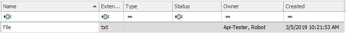

# Create Document
The following code shows an example how to save document to eWay-CRM. The document is first uploaded as binary data and then saved in eWay-CRM.
```c#

// Create Document
wcfConnection.UploadFile(@"C:\Users\user\Documents\File.txt", out Guid guid);
wcfConnection.CallMethod("SaveDocument", JObject.FromObject(new
{
    transmitObject = new
    {
        ItemGUID = guid,
        FileAs = "File.txt",
        DocName = "File",
        Extension = "txt",
        DocSize = 0
    }
}));

```

## Output

As output you should see the document created in outlook.




## Sample code

To see the whole sample code click  [here](Program.cs)