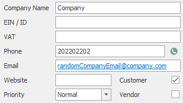

# Editing existing company
This sample shows how to edit existing company.


Here you can see the process of editing company. It is done by using method  `wcfConnection.CallMethod()`  with name of API function as first parameter and json object with Company specifications as second parameter
```c#

// Edit the company		
wcfConnection.CallMethod("SaveCompany", JObject.FromObject(new
{
    transmitObject = new
    {
        ItemGUID = "ebdd18f3-92e9-412d-afec-e1aaf6139b09",
        FileAs = "Company",
        CompanyName = "Company",
        Purchaser = "1",
        Phone = "202202202",
        Email = "randomCompanyEmail@company.cz"
    }
}));

```

This is what it should look like after the edit:



## Sample code

To see the whole sample code click [here](Program.cs)