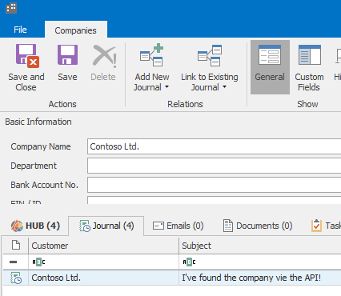

# eWay-CRM API C# Library

This small library helps you using the [eWay-CRM API](https://kb.eway-crm.com/documentation/6-add-ins/6-7-api-1). It is a wrapper over HTTP/S communication and sessions.

## Installation

### NuGet

The simpliest way to start using this library is to get the [NuGet Package](https://www.nuget.org/packages/eWayCRM.API). To do that, just run this command in your Package Manager Console (Visual Studio: Tools -> NuGet Package Manager -> Package Manager Console):
```
PM> Install-Package eWayCRM.API
```

## Usage

This library wraps the communication with JSON API. To provide the most variability, it lets you to input JSON data and fetch JSON data. For JSON representation, we have chosen the [NewtonSoft.Json/Json.NET](https://www.newtonsoft.com/json) library. As a consequence, be sure to have `using Newtonsoft.Json.Linq;` everywhere you need to work with our library.

The actual usage is then the same as it would be for example with [PHP](https://github.com/rstefko/eway-crm-php-lib). See the [documentation](https://kb.eway-crm.com/documentation/6-add-ins/6-7-api-1) for more.

The following code shows an example how to load some data from eWay-CRM and then save a journal entry. It searches for a company named 'Contoso Ltd.' and if it finds it, creates a journal record connected to the found company.

```
var connection = new eWayCRM.API.Connection("https://server.mycompany.com/eway", "jsmith", "YOUR_PASSWORD_HASH");
var searchedCompaniesResopnse = connection.CallMethod("SearchCompanies", JObject.FromObject(new
{
    transmitObject = new
    {
        FileAs = "Contoso Ltd."
    }
}));
if (((JArray)searchedCompaniesResopnse["Data"]).Count != 0)
{
    connection.CallMethod("SaveJournal", JObject.FromObject(new
    {
        transmitObject = new
        {
            Companies_CompanyGuid = ((JArray)searchedCompaniesResopnse["Data"]).First.Value<string>("ItemGUID"),
            FileAs = "I've found the company via the API!",
            Note = "Using the eWay-CRM API C# Library",
            EventStart = DateTime.Now.ToString("u"),
            EventEnd = DateTime.Now.ToString("u")
        }
    }));
}
```

The code above will result like this:

